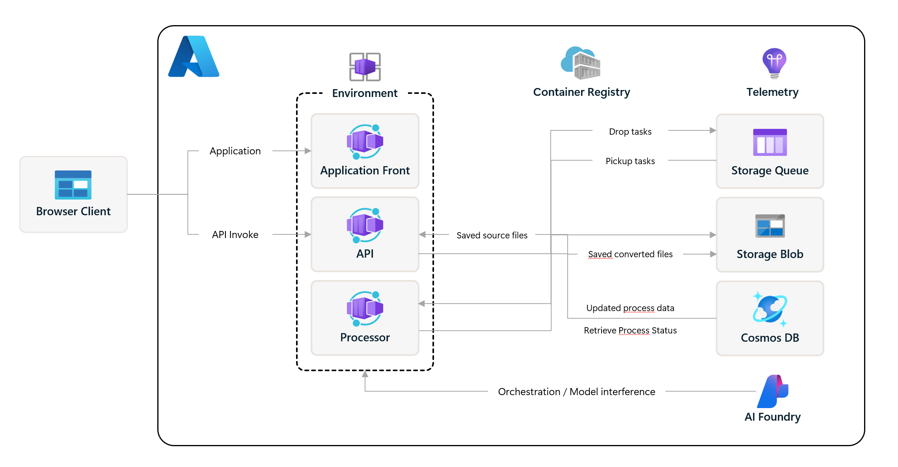

# Container Migration Solution Accelerator

Extract, analyze, and migrate Kubernetes configurations from other cloud providers to Azure Kubernetes Service (AKS) using intelligent multi-agent orchestration powered by Azure OpenAI GPT-5.1, Microsoft Agent Framework, and MCP (Model Context Protocol) servers. This solution provides automated platform detection, multi-dimensional analysis, and expert-guided configuration transformation with comprehensive migration reporting.

Transform your Kubernetes workloads with confidence through AI-driven analysis covering security, networking, storage, and Azure Well-Architected Framework principles. Expert agents collaborate to ensure your migrated configurations are production-ready and optimized for Azure.

**[SOLUTION OVERVIEW](#solution-overview)** | **[QUICK DEPLOY](#quick-deploy)** | **[MIGRATION SCENARIO](#migration-scenario)** | **[TECHNICAL DOCUMENTATION](#technical-documentation)**

## [Solution overview](#solution-overview)

This accelerator provides a complete enterprise migration platform leveraging Azure OpenAI GPT-5.1, Microsoft Agent Framework workflows, Azure Container Apps, Azure Blob Storage, Azure Storage Queue, and MCP (Model Context Protocol) servers. The solution consists of a React-based web application for file upload and validation, coupled with an intelligent multi-agent processing engine that analyzes and transforms Kubernetes configurations through event-driven batch processing pipelines.

The architecture follows enterprise-grade batch processing patterns with loosely coupled components, enabling organizations to migrate from managed cloud, enterprise distribution, and self-managed/on-prem Kubernetes platforms (for example: EKS, GKE/Anthos, OpenShift, Rancher/RKE/K3s, Tanzu, and upstream/on-prem Kubernetes) to Azure Kubernetes Service at scale while maintaining comprehensive audit trails and expert-level analysis quality.

### Solution architecture

## 

The solution uses a sophisticated multi-agent orchestration pattern where specialized expert agents collaborate to:

1. **Platform Detection**: Automatically identify source platform (other cloud providers platform)
2. **Multi-Dimensional Analysis**: Technical Architect, Azure Expert, cloud platform Experts, and QA Engineer agents analyze configurations
3. **Design Transformation**: Apply Azure Well-Architected Framework principles
4. **YAML Conversion**: Expert YAML transformation with security, networking, and storage optimizations
5. **Documentation Generation**: Comprehensive migration reports with expert insights

## Features

This solution enables enterprise-grade Kubernetes migration with the following capabilities:

   - **Enterprise Batch Processing Architecture**  
   Complete solution including React web application for file upload, validation, and queue management coupled with intelligent multi-agent processing engine

   - **Intelligent Platform Detection**  
   Automatically identifies source Kubernetes platform/distribution (for example: EKS, GKE/Anthos, OpenShift, Rancher/RKE/K3s, Tanzu, and self-managed/on-prem Kubernetes) through configuration analysis and applies platform-aware migration strategies

   - **Multi-Agent Expert Orchestration**  
   Specialized agents (Chief Architect, AKS Expert, platform experts, QA Engineer, Technical Writer, YAML Expert) collaborate using Microsoft Agent Framework group chat orchestration

   - **Workflow Engine**  
   Each migration step (analysis, design, conversion, documentation) is executed as a step-based Agent Framework workflow with explicit executor chaining

   - **MCP Server Tool Integration**  
   Agents access intelligent tools through Model Context Protocol servers for file operations, knowledge search, and specialized functions without direct model training

   - **Azure Well-Architected Framework Compliance**  
   Configurations transformed according to Azure security, reliability, performance, cost optimization, and operational excellence principles

   - **Comprehensive Migration Reporting**  
   Detailed reports capturing expert analysis, transformation decisions, and recommendations from multiple specialized agents

### Agentic Architecture

Orchestration flow: 4 workflow executors coordinate group chats and tools.

If you want to get know more detail about Agentic Architecture, please take a look at this document: [Agentic Architecture](docs/AgenticArchitecture.md)

### Technical implementation highlights
**Advanced AI Orchestration Patterns:**

- **Model**: Azure OpenAI GPT-5.1 for advanced reasoning and analysis capabilities
- **Framework**: Microsoft Agent Framework for multi-agent orchestration and workflow execution
- **Workflow Management**: Agent Framework `WorkflowBuilder` with step executors (analysis → design → yaml → documentation)
- **Tool Access**: MCP (Model Context Protocol) servers enabling intelligent tool selection and usage

**MCP Server Integration:**

- **Internal MCP Servers (FastMCP)**: Blob I/O, DateTime, Mermaid validation, YAML inventory
- **External MCP Servers**: Microsoft Learn Docs (HTTP) and Fetch (`uvx mcp-server-fetch`)
- **Intelligent Tool Selection**: Agents choose tools based on context

## Resources

### How to customize

If you'd like to customize the solution accelerator, here are some common areas to start:

[Adding Custom Expert Agents](docs/CustomizeExpertAgents.md)

[Modifying Migration Analysis Prompts](docs/CustomizeMigrationPrompts.md)

[Extending Platform Support](docs/ExtendPlatformSupport.md)

[Configuring MCP Servers](docs/ConfigureMCPServers.md)

### Additional resources

[Technical Architecture](docs/TechnicalArchitecture.md)

[Multi-Agent Orchestration Approach](docs/MultiAgentOrchestration.md)

[Workflow Implementation Guide](docs/ProcessFrameworkGuide.md)

[MCP Server Integration Guide](docs/MCPServerGuide.md)

## Getting Started

## [Quick deploy](#quick-deploy)

### How to install or deploy

The Container Migration Solution Accelerator supports development and deployment across multiple platforms and environments.

**For Azure Deployment:**
[Click here to launch the deployment guide](docs/DeploymentGuide.md)

**For Local Development:**
- [Local Development Setup Guide](docs/LocalDevelopmentSetup.md) - Comprehensive setup instructions for Windows, Linux, and macOS
- Includes native Windows setup, WSL2 configuration, and cross-platform development tools

> ⚠️ **Important: Check Azure OpenAI GPT-5.1 Availability**
> Model availability and quotas vary by region and subscription. Check the Azure OpenAI models catalog before deploying: https://learn.microsoft.com/azure/ai-services/openai/concepts/models

### Prerequisites and costs

To deploy this solution accelerator, ensure you have access to an [Azure subscription](https://azure.microsoft.com/free/) with the necessary permissions to create resource groups, resources, app registrations, and assign roles at the resource group level. This should include Contributor role at the subscription level and Role Based Access Control role on the subscription and/or resource group level.

**Required Azure Services:**

| Service                 | Description                                                                       | Pricing                                                                                   |
| ----------------------- | --------------------------------------------------------------------------------- | ----------------------------------------------------------------------------------------- |
| Azure OpenAI Service    | Provides REST API access to the GPT-5.1 model for advanced reasoning and analysis | [Pricing](https://azure.microsoft.com/pricing/details/cognitive-services/openai-service/) |
| Azure Container Apps    | Runs containerized migration processor without managing infrastructure            | [Pricing](https://azure.microsoft.com/pricing/details/container-apps/)                    |
| Azure Blob Storage      | Stores source configurations, processed files, and migration reports              | [Pricing](https://azure.microsoft.com/pricing/details/storage/blobs/)                     |
| Azure App Configuration | Manages application settings and agent configurations                             | [Pricing](https://azure.microsoft.com/pricing/details/app-configuration/)                 |
| Azure Queue Storage     | Handles event-driven processing and agent communication                           | [Pricing](https://azure.microsoft.com/pricing/details/storage/queues/)                    |

Pricing varies per region and usage, so it isn't possible to predict exact costs for your usage. The majority of the Azure resources used in this infrastructure are on usage-based pricing tiers.

Use the [Azure pricing calculator](https://azure.microsoft.com/pricing/calculator) to calculate the cost of this solution in your subscription.

**Model Access Requirements:**

- **Availability varies**: GPT-5.1 availability may vary by region and subscription.
- **Registration requirements**: Registration is required for access to `gpt-5.1`, `gpt-5.1-codex`, and `gpt-5.1-codex-max`. Request access here: [https://aka.ms/oai/gpt5access](https://aka.ms/oai/gpt5access). For region availability details, see [Model summary table and region availability](https://learn.microsoft.com/en-us/azure/ai-foundry/foundry-models/concepts/models-sold-directly-by-azure?view=foundry-classic&tabs=global-standard-aoai%2Cstandard-chat-completions%2Cglobal-standard&pivots=azure-openai#model-summary-table-and-region-availability).
- **Quota management**: Ensure sufficient quota for batch processing.

## Guidance

## [Migration Scenario](#migration-scenario)

A DevOps engineer at a multi-platform enterprise manages Kubernetes workloads across managed cloud and self-managed/on-prem clusters (for example: GKE, EKS, and on-prem Kubernetes) and needs to migrate critical applications to Azure Kubernetes Service (AKS) following company cloud consolidation strategy.

The engineer has dozens of complex Kubernetes configurations with intricate networking, storage, and security requirements. Manual migration analysis would take weeks and risk configuration errors that could impact production workloads.

Using the Migration Solution Accelerator, the complete processing flow works as follows:

### **Enterprise Batch Processing Architecture**

1. **Upload via Web Application**: Engineer uploads Kubernetes configuration files through the React-based Migration Web Application
2. **Automated File Inspection**: Web application performs comprehensive validation:
   - File format and content-type verification
   - YAML syntax validation
   - Platform consistency checks (prevents mixing incompatible source platforms in a single batch)
3. **Queue Generation**: After successful inspection, the system generates processing jobs with unique identifiers and submits them to Azure Storage Queue
4. **Migration Processor Activation**: The multi-agent migration processor (this solution) monitors the queue, picks up processing jobs, and begins intelligent analysis

>  ⚠️ **Important Note on Processing**: Processing is **queue-driven**. Concurrency is configurable (default is a single worker), so uploads may run sequentially or in parallel depending on deployment settings.

### **AI-Powered Migration Process**

Once the migration processor receives a queue message, expert AI agents automatically:

1. **Platform Detection**: Identify the most likely source Kubernetes platform/distribution (e.g., EKS/GKE/OpenShift/Rancher/Tanzu/On-prem) based on analyzed content
2. **Multi-Expert Analysis**: Technical Architect analyzes overall architecture, while the matching platform expert(s) identify migration challenges and Azure Expert applies Well-Architected Framework principles
3. **Quality Validation**: QA Engineer validates transformation logic and identifies potential issues
4. **YAML Transformation**: Expert YAML agent converts configurations with security, networking, and storage optimizations
5. **Comprehensive Documentation**: Generate detailed migration reports capturing all expert insights and transformation decisions

### **Loosely Coupled & API-Driven Architecture**

The solution provides enterprise-grade capabilities:

- **Batch Processing**: Handle multiple migration projects simultaneously through queue-based processing
- **API Integration**: External systems can leverage the migration engine through programmatic queue submission
- **Scalable Processing**: Independent scaling of web interface and processing engine components
- **Fault Tolerance**: Queue-based architecture ensures reliable processing with retry capabilities

Thanks to this enterprise batch processing architecture and AI-powered multi-agent orchestration, migrations that previously took weeks are completed in hours with higher accuracy, comprehensive documentation, and full audit trails.

> ⚠️ **Note**: This solution uses Azure OpenAI GPT-5.1 for advanced reasoning. Model availability and access requirements vary by region and subscription. Sample configurations in this repository are for demonstration purposes.

### Business value

This solution provides significant value through intelligent automation:

- **Accelerated Migration Timeline**: Reduce weeks of manual analysis to hours of automated processing
- **Expert-Level Analysis**: Multiple specialized AI agents provide comprehensive platform expertise
- **Risk Reduction**: Automated validation and Azure best practices reduce migration risks
- **Comprehensive Documentation**: Detailed reports capture all transformation decisions
- **Cost Optimization**: Azure Well-Architected Framework principles optimize cloud spend
- **Scalable Process**: Handle multiple migration projects with consistent quality

## [Technical documentation](#technical-documentation)

### Multi-agent orchestration architecture

This solution implements advanced multi-agent patterns using Microsoft Agent Framework group chat orchestration:

**Expert Agent Specializations:**

- **Technical Architect**: Overall architecture analysis and design decisions
- **Azure Expert**: Azure-specific optimizations and Well-Architected Framework compliance
- **GKE Expert**: Google Kubernetes Engine (GKE/Anthos) specific knowledge and migration patterns
- **EKS Expert**: Amazon Elastic Kubernetes Service expertise and AWS-to-Azure translations
- **OpenShift Expert**: Red Hat OpenShift specific patterns and transformations
- **Rancher Expert**: Rancher/RKE/RKE2/K3s patterns and migration considerations
- **Tanzu Expert**: VMware Tanzu/TKG patterns and migration considerations
- **OnPremK8s Expert**: Upstream/self-managed/on-prem Kubernetes patterns and common on-prem dependencies
- **QA Engineer**: Validation, testing strategies, and quality assurance
- **YAML Expert**: Configuration transformation and syntax optimization

**Workflow Integration:**
Each migration step is implemented as an Agent Framework workflow with explicit executor chaining:

**MCP Server Integration:**
Agents access tools through Model Context Protocol servers for intelligent capability extension:

- **Blob Operations MCP**: File reading/writing and artifact management (Azure Blob Storage)
- **Microsoft Learn Docs MCP (HTTP)**: Documentation search/retrieval and best-practices lookup
- **DateTime MCP**: Timestamp generation and time-based operations
- **Fetch MCP**: URL fetching for validation (for example: verifying references)
- **Mermaid Validation MCP**: Validate Mermaid diagrams generated during design/docs steps
- **YAML Inventory MCP**: Enumerate converted YAML objects for runbooks and reports

### Cross references

Check out related Microsoft solution accelerators:

| Solution                                                                                                        | Description                                                   |
| --------------------------------------------------------------------------------------------------------------- | ------------------------------------------------------------- |
| [Content Processing Solution Accelerator](https://github.com/microsoft/content-processing-solution-accelerator) | Process and extract data from unstructured documents using AI |
| [Document Knowledge Mining](https://github.com/microsoft/Document-Knowledge-Mining-Solution-Accelerator)        | Extract insights from documents with AI-powered search        |

## Provide feedback
Have questions, find a bug, or want to request a feature? [Submit a new issue](https://github.com/microsoft/container-migration-solution-accelerator/issues) on this repo and we'll connect.

## Responsible AI Transparency FAQ
Please refer to [Transparency FAQ](./TRANSPARENCY_FAQ.md) for responsible AI transparency details of this solution accelerator.

## Data Collection

The software may collect information about you and your use of the software and send it to Microsoft. Microsoft may use this information to provide services and improve our products and services. You may turn off the telemetry as described in the repository. There are also some features in the software that may enable you and Microsoft to collect data from users of your applications. If you use these features, you must comply with applicable law, including providing appropriate notices to users of your applications together with a copy of [Microsoft’s privacy statement](https://go.microsoft.com/fwlink/?LinkID=824704). You can learn more about data collection and use in the help documentation and our privacy statement. Your use of the software operates as your consent to these practices.

### Telemetry Configuration

This repository uses telemetry to track and monitor usage. There are two means of telemetry being used for this purpose: [Azure Developer CLI (AZD)](https://learn.microsoft.com/en-us/azure/developer/azure-developer-cli/overview?tabs=windows) and using [Azure Verified Modules (AVM)](https://azure.github.io/Azure-Verified-Modules/) for provisioning resources. Telemetry collection in this solution is enabled by default.

To opt out, perform the following steps:

1. Set the environment variable `AZURE_DEV_COLLECT_TELEMETRY` to `no` in your environment prior to deploying.
2. Set the `enableTelemetry` parameter value in `main.parameters.json` to `false` prior to deploying.

## Trademarks

This project may contain trademarks or logos for projects, products, or services. Authorized use of Microsoft trademarks or logos is subject to and must follow Microsoft’s Trademark & Brand Guidelines. Use of Microsoft trademarks or logos in modified versions of this project must not cause confusion or imply Microsoft sponsorship. Any use of third-party trademarks or logos are subject to those third-party’s policies.

## Disclaimers

To the extent that the Software includes components or code used in or derived from Microsoft products or services, including without limitation Microsoft Azure Services (collectively, “Microsoft Products and Services”), you must also comply with the Product Terms applicable to such Microsoft Products and Services. You acknowledge and agree that the license governing the Software does not grant you a license or other right to use Microsoft Products and Services. Nothing in the license or this ReadMe file will serve to supersede, amend, terminate or modify any terms in the Product Terms for any Microsoft Products and Services.

You must also comply with all domestic and international export laws and regulations that apply to the Software, which include restrictions on destinations, end users, and end use. For further information on export restrictions, visit https://aka.ms/exporting.

You acknowledge that the Software and Microsoft Products and Services (1) are not designed, intended or made available as a medical device(s), and (2) are not designed or intended to be a substitute for professional medical advice, diagnosis, treatment, or judgment and should not be used to replace or as a substitute for professional medical advice, diagnosis, treatment, or judgment. Customer is solely responsible for displaying and/or obtaining appropriate consents, warnings, disclaimers, and acknowledgements to end users of Customer’s implementation of the Online Services.

You acknowledge the Software is not subject to SOC 1 and SOC 2 compliance audits. No Microsoft technology, nor any of its component technologies, including the Software, is intended or made available as a substitute for the professional advice, opinion, or judgement of a certified financial services professional. Do not use the Software to replace, substitute, or provide professional financial advice or judgment.

BY ACCESSING OR USING THE SOFTWARE, YOU ACKNOWLEDGE THAT THE SOFTWARE IS NOT DESIGNED OR INTENDED TO SUPPORT ANY USE IN WHICH A SERVICE INTERRUPTION, DEFECT, ERROR, OR OTHER FAILURE OF THE SOFTWARE COULD RESULT IN THE DEATH OR SERIOUS BODILY INJURY OF ANY PERSON OR IN PHYSICAL OR ENVIRONMENTAL DAMAGE (COLLECTIVELY, “HIGH-RISK USE”), AND THAT YOU WILL ENSURE THAT, IN THE EVENT OF ANY INTERRUPTION, DEFECT, ERROR, OR OTHER FAILURE OF THE SOFTWARE, THE SAFETY OF PEOPLE, PROPERTY, AND THE ENVIRONMENT ARE NOT REDUCED BELOW A LEVEL THAT IS REASONABLY, APPROPRIATE, AND LEGAL, WHETHER IN GENERAL OR IN A SPECIFIC INDUSTRY. BY ACCESSING THE SOFTWARE, YOU FURTHER ACKNOWLEDGE THAT YOUR HIGH-RISK USE OF THE SOFTWARE IS AT YOUR OWN RISK.
