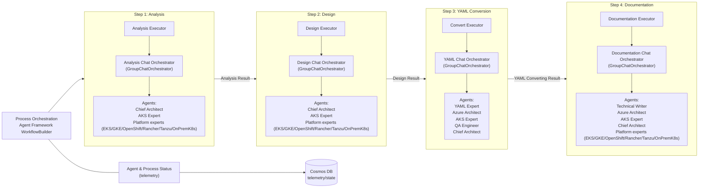
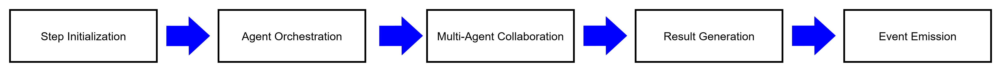

# Agentic Architecture - Container Migration Solution Accelerator

High-level view of how the 4-step orchestration works (executors, group chat orchestrators, and tools).

## Architecture Overview



## Agent Specialization by Phase

### Analysis Phase Agents

- **Chief Architect**: Leads overall analysis strategy and coordination
- **AKS Expert**: Reviews for AKS/Azure migration readiness
- **Platform experts**: Registry-loaded participants (EKS/GKE/OpenShift/Rancher/Tanzu/OnPremK8s); coordinator keeps non-matching experts quiet

### Design Phase Agents

- **Chief Architect**: Defines migration architecture patterns and reconciles trade-offs
- **AKS Expert**: Ensures AKS-specific conventions and constraints are applied
- **Platform experts**: Provide source-platform context and constraints for the detected platform

### YAML Conversion Phase Agents

- **YAML Expert**: Performs configuration transformations and syntax optimization
- **Azure Architect**: Ensures Azure service integration and compliance
- **AKS Expert**: Ensures converted manifests align with AKS expectations
- **QA Engineer**: Validates converted configurations and tests
- **Chief Architect**: Provides overall review and integration

### Documentation Phase Agents

- **Technical Writer**: Creates comprehensive migration documentation
- **Azure Architect**: Documents Azure-specific configurations and optimizations
- **AKS Expert**: Documents AKS-focused implementation guidance and caveats
- **Chief Architect**: Provides architectural documentation and migration summary
- **Platform experts**: Document source platform analysis and transformation logic

## Data Flow Architecture

### Input Processing

1. **Web app** creates a migration request
2. **Queue worker service** receives the migration request from **Azure Storage Queue**
3. **Migration Processor** runs the end-to-end workflow (analysis → design → yaml → documentation)

### Step Execution Pattern

Each step follows this pattern:



### Storage Integration

- **Source Files**: Read from Azure Blob Storage via MCP Blob Operations
- **Working Files**: All processing files managed through Azure Blob Storage
- **Output Files**: Generated configurations and reports saved to Azure Blob Storage
- **Telemetry**: Agent interactions and process metrics stored in Azure Cosmos DB

### MCP Server Integration

All agents have access to Model Context Protocol (MCP) servers via Microsoft Agent Framework tool abstractions:

- **Blob Operations**: File reading/writing to Azure Blob Storage
- **Microsoft Docs**: Azure documentation lookup and best practices
- **DateTime Utilities**: Timestamp generation and time-based operations
- **Fetch**: URL fetching for validation (e.g., verifying references)
- **YAML Inventory**: Enumerate converted YAML objects for runbooks

## Key Architectural Principles

### Single Responsibility

Each step has a focused objective:

- Analysis: Platform detection and file discovery
- Design: Azure architecture and service mapping
- YAML: Configuration transformation and validation
- Documentation: Comprehensive report generation

### Event-Driven Orchestration

Steps are executed as a directed workflow (with start node and edges) using the Agent Framework workflow engine.
The processor emits workflow/executor events for observability and telemetry.

### Multi-Agent Collaboration

Within each step, specialized agents collaborate through group chat orchestration:

- Structured conversation patterns
- Domain expertise contribution
- Consensus building on decisions
- Quality validation and review

### Evaluation and Quality Checks

The processor uses multiple quality signals to reduce regressions and increase reliability:

- **Typed step outputs**: workflow executors and orchestrators exchange typed models per step (analysis → design → yaml → documentation).
- **QA sign-offs**: the QA agent focuses on validation steps and flags missing/unsafe transformations.
- **Tool-backed validation**: steps can call validation tools via MCP (e.g., Mermaid validation, YAML inventory grounding, docs lookups).
- **Unit tests**: processor unit tests live under [src/processor/src/tests/unit/](../src/processor/src/tests/unit/).

### Tool-Enabled Intelligence

Agents access external capabilities through MCP servers:

- Cloud storage integration
- Documentation lookup
- Time-based operations

### Observability & Monitoring

Comprehensive tracking throughout the process:

- Agent interaction telemetry
- Process execution metrics
- Error handling and recovery
- Performance optimization data

## File Location Mapping

```text
src/processor/src/
├── main_service.py                             # Queue worker entry point
├── services/queue_service.py                   # Azure Storage Queue consumer
├── services/control_api.py                     # Control API (health/kill)
├── services/process_control.py                 # Process control store/manager
├── steps/migration_processor.py                # WorkflowBuilder + step chaining
├── steps/analysis/workflow/analysis_executor.py
├── steps/design/workflow/design_executor.py
├── steps/convert/workflow/yaml_convert_executor.py
└── steps/documentation/
    ├── orchestration/documentation_orchestrator.py
    ├── workflow/documentation_executor.py
    └── agents/                                  # Agent prompt files
```

## Summary

This architecture implements a sophisticated agentic system that combines:

- **Microsoft Agent Framework Workflow** for structured workflow execution
- **Multi-Agent Group Chat Orchestration** for domain expertise collaboration
- **Model Context Protocol (MCP)** for tool integration and external system access
- **Azure Cloud Services** for scalable storage and data management
- **Event-Driven Architecture** for loose coupling and reliability

The result is a robust, scalable, and extensible migration solution that leverages the collective intelligence of specialized AI agents working in concert to solve complex container migration challenges.
