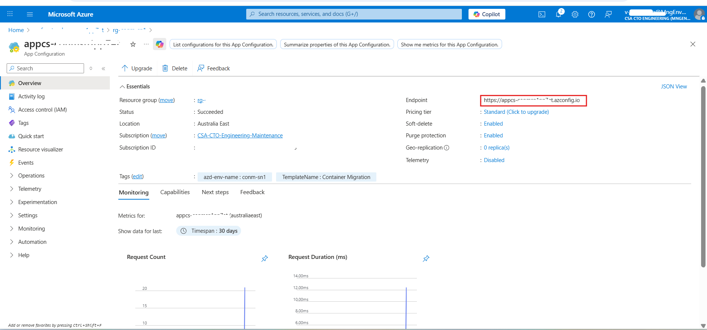

# Local Development Setup Guide

This guide provides comprehensive instructions for setting up the Container Migration Solution Accelerator for local development across Windows and Linux platforms.

## Important Setup Notes

### Multi-Service Architecture

This application consists of **three separate services** that run independently:

1. **Processor** - Handles migration logic (Queue Mode or Direct Mode)
2. **Backend API** - REST API server for the frontend
3. **Frontend** - React-based user interface

> **⚠️ Critical: Each service must run in its own terminal/console window**
>
> - **Do NOT close terminals** while services are running
> - Open **3 separate terminal windows** for local development
> - Each service will occupy its terminal and show live logs
>
> **Terminal Organization:**
> - **Terminal 1**: Processor (Queue Mode) - Runs continuously, polls for messages
> - **Terminal 2**: Backend API - HTTP server on port 8000
> - **Terminal 3**: Frontend - Development server on port 5173

### Path Conventions

**All paths in this guide are relative to the repository root directory:**

```bash
Container-Migration-Solution-Accelerator/    ← Repository root (start here)
├── src/
│   ├── processor/                           
│   │   ├── .venv/                          
│   │   └── src/                            
│   │       ├── main.py                     ← Direct Mode entry point
│   │       ├── main_service.py             ← Queue Mode entry point
│   │       └── .env                        ← Processor config file
│   ├── backend-api/                         
│   │   ├── .venv/                          ← Virtual environment
│   │   └── src/app/                        
│   │       ├── main.py                     ← API entry point
│   │       └── .env                        ← Backend API config file
│   └── frontend/                           
│       ├── node_modules/                    
│       └── .env                            ← Frontend config file
└── docs/                                   ← Documentation (you are here)
```

**Before starting any step, ensure you are in the repository root directory:**

```bash
# Verify you're in the correct location
pwd  # Linux/macOS - should show: .../Container-Migration-Solution-Accelerator
Get-Location  # Windows PowerShell - should show: ...\Container-Migration-Solution-Accelerator

# If not, navigate to repository root
cd path/to/Container-Migration-Solution-Accelerator
```

### Configuration Files

This project uses separate `.env` files in each service directory with different configuration requirements:

- **Processor**: `src/processor/src/.env` - Azure App Configuration URL
- **Backend API**: `src/backend-api/src/app/.env` - Azure App Configuration URL  
- **Frontend**: `src/frontend/.env` - Azure AD authentication settings

When copying `.env` samples, always navigate to the specific service directory first.

## Step 1: Prerequisites - Install Required Tools

### Windows Development

#### Option 1: Native Windows (PowerShell)

```powershell
# Install Python 3.12+ and Git
winget install Python.Python.3.12
winget install Git.Git

# Install Node.js for frontend
winget install OpenJS.NodeJS.LTS

# Install uv package manager
py -3.12 -m pip install uv
```

**Note**: On Windows, use `py -3.12 -m uv` instead of `uv` for all commands to ensure you're using Python 3.12.

#### Option 2: Windows with WSL2 (Recommended)

```bash
# Install WSL2 first (run in PowerShell as Administrator):
# wsl --install -d Ubuntu

# Then in WSL2 Ubuntu terminal:
sudo apt update && sudo apt install python3.12 python3.12-venv git curl nodejs npm -y

# Install uv
curl -LsSf https://astral.sh/uv/install.sh | sh
source ~/.bashrc
```

### Linux Development

#### Ubuntu/Debian

```bash
# Install prerequisites
sudo apt update && sudo apt install python3.12 python3.12-venv git curl nodejs npm -y

# Install uv package manager
curl -LsSf https://astral.sh/uv/install.sh | sh
source ~/.bashrc
```

#### RHEL/CentOS/Fedora

```bash
# Install prerequisites
sudo dnf install python3.12 python3.12-devel git curl gcc nodejs npm -y

# Install uv
curl -LsSf https://astral.sh/uv/install.sh | sh
source ~/.bashrc
```

### Clone the Repository

```bash
git clone https://github.com/microsoft/Container-Migration-Solution-Accelerator.git
cd Container-Migration-Solution-Accelerator
```

## Step 2: Development Tools Setup

### Visual Studio Code (Recommended)

#### Required Extensions

Create `.vscode/extensions.json` in the workspace root and copy the following JSON:

```json
{
    "recommendations": [
        "ms-python.python",
        "ms-python.pylint",
        "ms-python.black-formatter",
        "ms-python.isort",
        "ms-vscode-remote.remote-wsl",
        "ms-vscode-remote.remote-containers",
        "redhat.vscode-yaml",
        "ms-vscode.azure-account",
        "ms-python.mypy-type-checker"
    ]
}
```

VS Code will prompt you to install these recommended extensions when you open the workspace.

#### Settings Configuration

Create `.vscode/settings.json` and copy the following JSON:

```json
{
    "python.defaultInterpreterPath": "./.venv/bin/python",
    "python.terminal.activateEnvironment": true,
    "python.formatting.provider": "black",
    "python.linting.enabled": true,
    "python.linting.pylintEnabled": true,
    "python.testing.pytestEnabled": true,
    "python.testing.unittestEnabled": false,
    "files.associations": {
        "*.yaml": "yaml",
        "*.yml": "yaml"
    }
}
```

## Step 3: Deploy Azure Infrastructure (Required)

> **⚠️ Important**: Before proceeding, you must deploy the Azure infrastructure that the local services connect to (App Configuration, Cosmos DB, Storage Account, AI Services, etc.). The local services do **not** run standalone — they require deployed Azure resources.

If you haven't already deployed the infrastructure, follow the [Deployment Guide](DeploymentGuide.md) or run:

```bash
# Authenticate with Azure Developer CLI
azd auth login

# Deploy infrastructure and application
azd up
```

During `azd up`, you'll be prompted for environment name, subscription, region, and resource group. After deployment completes (~5-7 minutes), note the resource group name — you'll need it for the next steps.

> **Note**: You only need the **infrastructure** deployed. For local development, you'll run the Processor, Backend API, and Frontend locally instead of using the deployed Container Apps.

## Step 4: Azure Authentication Setup

Before configuring services, authenticate with Azure:

```bash
# Login to Azure CLI
az login

# Set your subscription
az account set --subscription "your-subscription-id"

# Verify authentication
az account show
```

### Get Azure App Configuration URL

Navigate to your resource group and select the resource with prefix `appcs-` to get the configuration URL:

```bash
APP_CONFIGURATION_URL=https://[Your app configuration service name].azconfig.io
```

For reference, see the image below:


### Required Azure RBAC Permissions

To run the application locally, your Azure account needs the following role assignments on the deployed resources:

#### App Configuration Access

**Linux/macOS:**
```bash
# Get your principal ID
PRINCIPAL_ID=$(az ad signed-in-user show --query id -o tsv)

# Assign App Configuration Data Reader role
az role assignment create \
  --assignee $PRINCIPAL_ID \
  --role "App Configuration Data Reader" \
  --scope "/subscriptions/<subscription-id>/resourceGroups/<resource-group>/providers/Microsoft.AppConfiguration/configurationStores/<appconfig-name>"
```

**Windows PowerShell:**
```powershell
# Get your principal ID
$PRINCIPAL_ID = az ad signed-in-user show --query id -o tsv

# Assign App Configuration Data Reader role
az role assignment create --assignee $PRINCIPAL_ID --role "App Configuration Data Reader" --scope "/subscriptions/<subscription-id>/resourceGroups/<resource-group>/providers/Microsoft.AppConfiguration/configurationStores/<appconfig-name>"
```

#### Cosmos DB Access

**Linux/macOS:**
```bash
# Assign Cosmos DB Built-in Data Contributor role
az cosmosdb sql role assignment create \
  --account-name <cosmos-account-name> \
  --resource-group <resource-group> \
  --role-definition-name "Cosmos DB Built-in Data Contributor" \
  --principal-id $PRINCIPAL_ID \
  --scope "/"
```

**Windows PowerShell:**
```powershell
az cosmosdb sql role assignment create --account-name <cosmos-account-name> --resource-group <resource-group> --role-definition-name "Cosmos DB Built-in Data Contributor" --principal-id $PRINCIPAL_ID --scope "/"
```

#### Other Required Roles
Depending on the features you use, you may also need:
- **Storage Blob Data Contributor** - For Azure Storage operations
- **Storage Queue Data Contributor** - For queue-based processing
- **Azure OpenAI User** - For AI model access

**Note**: RBAC permission changes can take 5-10 minutes to propagate. If you encounter "Forbidden" errors after assigning roles, wait a few minutes and try again.

## Step 5: Processor Setup & Run Instructions

> **📋 Terminal Reminder**: Open a **dedicated terminal window (Terminal 1)** for the Processor service. All commands in this section assume you start from the **repository root directory**.

The Processor handles the actual migration logic and can run in two modes:
- **Queue-based mode** (`main_service.py`): Processes migration requests from Azure Storage Queue (production)
- **Direct execution mode** (`main.py`): Runs migrations directly without queue (development/testing)

### 5.1. Navigate to Processor Directory

```bash
cd src/processor
```

### 5.2. Configure Processor Environment Variables

Create a `.env` file in the `src/processor/src` directory (NOT in `src/processor` root).

You can copy the example file as a starting point, then move it to the correct location:

```bash
# Linux/macOS
cp .env.example src/.env

# Windows PowerShell
Copy-Item .env.example src\.env
```

Edit `src/.env` and set the App Configuration URL:

```bash
APP_CONFIGURATION_URL=https://[Your app configuration service name].azconfig.io
```

> **⚠️ Important**: The `.env` file must be located in `src/processor/src/` directory, not in `src/processor/` root. The application looks for the `.env` file in the same directory as `main.py` and `main_service.py`.

### 5.3. Install Processor Dependencies

```bash
# Create and activate virtual environment
uv venv .venv

# Activate virtual environment
source .venv/bin/activate  # Linux/WSL2
# or
.\.venv\Scripts\Activate.ps1  # Windows PowerShell

# Install dependencies
uv sync --python 3.12
```

**Windows users**: If you encounter issues with the `uv` command not being found, use the Python Launcher instead:

```powershell
# Create virtual environment
py -3.12 -m uv venv .venv

# Install dependencies
py -3.12 -m uv sync --python 3.12
```

> **⚠️ Important**: Always run `uv sync` (or `py -3.12 -m uv sync` on Windows) after creating the virtual environment to install all required dependencies. Missing dependencies will cause runtime errors like `ModuleNotFoundError: No module named 'pydantic'` or DNS resolution failures.

### 5.4. Run the Processor

#### Option A: Queue-Based Mode (Production) [Preferred for local set up]

Process migration requests from Azure Storage Queue:

**Important**: This mode requires the **Storage Queue Data Contributor** role on the Azure Storage Account. Assign it using:

**Linux/macOS:**
```bash
# Get your principal ID and subscription ID
PRINCIPAL_ID=$(az ad signed-in-user show --query id -o tsv)
SUBSCRIPTION_ID=$(az account show --query id -o tsv)

# Assign Storage Queue Data Contributor role
az role assignment create \
  --role "Storage Queue Data Contributor" \
  --assignee $PRINCIPAL_ID \
  --scope "/subscriptions/$SUBSCRIPTION_ID/resourceGroups/<resource-group>/providers/Microsoft.Storage/storageAccounts/<storage-account-name>"
```

**Windows PowerShell:**
```powershell
$PRINCIPAL_ID = az ad signed-in-user show --query id -o tsv
$SUBSCRIPTION_ID = az account show --query id -o tsv

az role assignment create --role "Storage Queue Data Contributor" --assignee $PRINCIPAL_ID --scope "/subscriptions/$SUBSCRIPTION_ID/resourceGroups/<resource-group>/providers/Microsoft.Storage/storageAccounts/<storage-account-name>"
```

> **Note**: Permission changes take 5-10 minutes to propagate.

Run the queue service:

```bash
cd src
python main_service.py
```

This mode provides:
- Automatic retry logic with exponential backoff
- Production-ready error handling
- Message polling with "No messages in main queue" logs

#### Option B: Direct Execution Mode (Development/Testing)

Run migrations directly without queue infrastructure:

```bash
cd src
python main.py
```

This mode is useful for:
- Running single migrations
- Debugging migration logic
- Quick testing without queue setup

## Step 6: Backend API Setup & Run Instructions

> **📋 Terminal Reminder**: Open a **second dedicated terminal window (Terminal 2)** for the Backend API. Keep Terminal 1 (Processor) running. All commands assume you start from the **repository root directory**.

The Backend API provides REST endpoints for the frontend and handles API requests.

### 6.1. Navigate to Backend API Directory

```bash
# From repository root
cd src/backend-api
```

### 6.2. Configure Backend API Environment Variables

Create a `.env` file in the `src/backend-api/src/app` directory:

```bash
cd src/app

# Copy the example file
cp .env.example .env  # Linux
# or
Copy-Item .env.example .env  # Windows PowerShell
```

Edit the `.env` file and set the App Configuration URL (same value as the Processor):

```bash
APP_CONFIGURATION_URL=https://[Your app configuration service name].azconfig.io
```

### 6.3. Install Backend API Dependencies

```bash
# Navigate back to backend-api root
cd ../..

# Create and activate virtual environment
uv venv .venv

# Activate virtual environment
source .venv/bin/activate  # Linux/WSL2
# or
.\.venv\Scripts\Activate.ps1  # Windows PowerShell

# Install dependencies
uv sync --python 3.12
```

### 6.4. Run the Backend API

```bash
# Make sure you're in the backend-api/src/app directory
cd src/app

# Run with uvicorn
python -m uvicorn main:app --host 0.0.0.0 --port 8000
```

> **⚠️ Windows Note**: Do **not** use the `--reload` flag on Windows. The file watcher monitors `.venv` directories and causes repeated crash loops. If you need auto-reload on Linux/macOS, use:
> ```bash
> python -m uvicorn main:app --reload --reload-exclude ".venv" --host 0.0.0.0 --port 8000
> ```

The Backend API will start at:
- API: `http://localhost:8000`
- API Documentation: `http://localhost:8000/docs`

## Step 7: Frontend (UI) Setup & Run Instructions

> **📋 Terminal Reminder**: Open a **third dedicated terminal window (Terminal 3)** for the Frontend. Keep Terminals 1 (Processor) and 2 (Backend API) running. All commands assume you start from the **repository root directory**.

The UI is located under `src/frontend`.

### 7.1. Navigate to Frontend Directory

```bash
# From repository root
cd src/frontend
```

### 7.2. Install UI Dependencies

```bash
npm install
```

### 7.3. Configure UI Environment Variables

Create a `.env` file in the `src/frontend` directory:

```bash
# Copy the example file
cp .env.example .env  # Linux
# or
Copy-Item .env.example .env  # Windows PowerShell
```

Edit the `.env` file with your Azure AD configuration:

```bash
# Required: Your Azure AD app registration client ID (frontend app registration)
VITE_APP_WEB_CLIENT_ID=your-frontend-client-id-here

# Required: Your Azure AD tenant authority
VITE_APP_WEB_AUTHORITY=https://login.microsoftonline.com/your-tenant-id

# Optional: Redirect URLs (defaults to current origin)
VITE_APP_REDIRECT_URL=http://localhost:5173
VITE_APP_POST_REDIRECT_URL=http://localhost:5173

# Required: Scopes for login and token acquisition
# Use the user_impersonation scope from your app registrations
VITE_APP_WEB_SCOPE=api://your-frontend-client-id/user_impersonation
VITE_APP_API_SCOPE=api://your-backend-api-client-id/user_impersonation

# Required: Backend API URL
VITE_API_URL=http://localhost:8000/api

# Required: Enable/disable MSAL authentication
# Set to "false" for local development without Azure AD login
# Set to "true" to enable Azure AD authentication
VITE_ENABLE_AUTH=false
```

> **⚠️ Important Notes:**
>
> 1. **`VITE_ENABLE_AUTH` controls authentication:**
>    - Set to `false` to bypass Azure AD login and access the UI directly (easiest for local dev)
>    - Set to `true` if you need to test the full MSAL authentication flow
>    - The deployed app always uses authentication; this setting is for local development convenience
>
> 2. **Scope Configuration:**
>    - The `user_impersonation` scope is created automatically during `azd up` deployment
>    - Find your client IDs in Azure Portal → App registrations (look for `ca-frontend-*` and `ca-backend-api-*`)
>    - See [ConfigureAppAuthentication.md](ConfigureAppAuthentication.md) for detailed setup
>
> 3. **App Registration for Authentication (if `VITE_ENABLE_AUTH=true`):**
>    - Go to **Azure Portal → Microsoft Entra ID → App registrations → Your frontend app**
>    - Under **Authentication**, add a **Single-page application (SPA)** platform
>    - Add redirect URI: `http://localhost:5173`
>    - Click **Save**
>
> 4. **Common Error: AADSTS900561**
>    - If you see "The endpoint only accepts POST requests. Received a GET request"
>    - Ensure the platform type is **Single-page application (SPA)**, not "Web"
>    - Clear browser cache or use incognito mode after fixing
>
> 5. **Restart Required:**
>    - After updating `.env`, **stop and restart** the frontend dev server (`npm run dev`)
>    - Vite caches environment variables at startup and won't pick up changes until restarted

### 7.4. Start Development Server

```bash
npm run dev
```

> **Note**: You do **not** need to run `npm run build` for local development. `npm run dev` starts a development server with hot module replacement (HMR).

The app will start at:

```
http://localhost:5173
```

(or whichever port Vite assigns)

## Troubleshooting

### Common Issues

#### Python Version Issues

```bash
# Check available Python versions
python3 --version
python3.12 --version

# If python3.12 not found, install it:
# Ubuntu: sudo apt install python3.12
# Windows: winget install Python.Python.3.12
```

#### Virtual Environment Issues

```bash
# Recreate virtual environment
rm -rf .venv  # Linux
# or Remove-Item -Recurse .venv  # Windows PowerShell

uv venv .venv
# Activate and reinstall
source .venv/bin/activate  # Linux
# or .\.venv\Scripts\Activate.ps1  # Windows
uv sync --python 3.12
```

#### Permission Issues (Linux)

```bash
# Fix ownership of files
sudo chown -R $USER:$USER .

# Fix uv permissions
chmod +x ~/.local/bin/uv
```

#### Windows-Specific Issues

```powershell
# PowerShell execution policy
Set-ExecutionPolicy -ExecutionPolicy RemoteSigned -Scope CurrentUser

# Long path support (Windows 10 1607+, run as Administrator)
New-ItemProperty -Path "HKLM:\SYSTEM\CurrentControlSet\Control\FileSystem" -Name "LongPathsEnabled" -Value 1 -PropertyType DWORD -Force

# SSL certificate issues
pip install --trusted-host pypi.org --trusted-host pypi.python.org --trusted-host files.pythonhosted.org uv
```

### Environment Variable Issues

```bash
# Check environment variables are loaded
env | grep AZURE  # Linux
Get-ChildItem Env:AZURE*  # Windows PowerShell

# Validate .env file format
cat .env | grep -v '^#' | grep '='  # Should show key=value pairs
```

## Step 8: Verify All Services Are Running

Before using the application, confirm all three services are running in separate terminals:

### Terminal Status Checklist

| Terminal | Service | Command | Expected Output | URL |
|----------|---------|---------|-----------------|-----|
| **Terminal 1** | Processor (Queue Mode) | `python main_service.py` | `INFO: No messages in main queue` (repeating every 5s) | N/A |
| **Terminal 2** | Backend API | `python -m uvicorn main:app --host 0.0.0.0 --port 8000` | `INFO: Application startup complete` | http://localhost:8000 |
| **Terminal 3** | Frontend | `npm run dev` | `Local: http://localhost:5173/` | http://localhost:5173 |

### Quick Verification

**1. Check Backend API:**
```bash
# In a new terminal (Terminal 4)
curl http://localhost:8000/health
# Expected: {"message":"I'm alive!"}
```

**2. Check Frontend:**
- Open browser to http://localhost:5173
- Should see the Container Migration UI
- If authentication is configured, you'll be redirected to Azure AD login

**3. Check Processor:**
- Look at Terminal 1 output
- Should see regular polling messages: `INFO: No messages in main queue`
- No error messages

### Common Issues

**Service not starting?**
- Ensure you're in the correct directory
- Verify virtual environment is activated (Python services)
- Check that port is not already in use (8000 for API, 5173 for frontend)
- Review error messages in the terminal

**Can't access services?**
- Verify firewall isn't blocking ports 8000 or 5173
- Try `http://localhost:port` instead of `http://127.0.0.1:port`
- Ensure services show "startup complete" messages

## Step 9: Next Steps

Once all services are running (as confirmed in Step 7), you can:

1. **Access the Application**: Open `http://localhost:5173` in your browser to explore the frontend UI
2. **Try a Sample Workflow**: Follow [SampleWorkflow.md](SampleWorkflow.md) for a guided walkthrough of the migration process
3. **Explore the Codebase**: Start with `src/processor/src/main_service.py` to understand the agent architecture
4. **Customize Agents**: Follow [CustomizeExpertAgents.md](CustomizeExpertAgents.md) to modify agent behavior
5. **Extend Platform Support**: Follow [ExtendPlatformSupport.md](ExtendPlatformSupport.md) to add new cloud platforms

## Related Documentation

- [Deployment Guide](DeploymentGuide.md) - Production deployment instructions
- [Technical Architecture](TechnicalArchitecture.md) - System architecture overview
- [Extending Platform Support](ExtendPlatformSupport.md) - Adding new platform support
- [Configuring MCP Servers](ConfigureMCPServers.md) - MCP server configuration
- [Multi-Agent Orchestration](MultiAgentOrchestration.md) - Agent collaboration patterns
