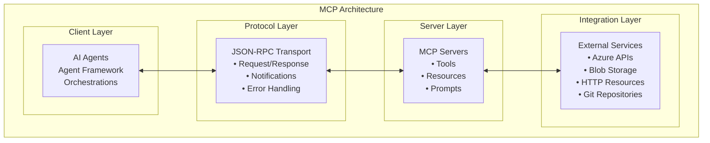
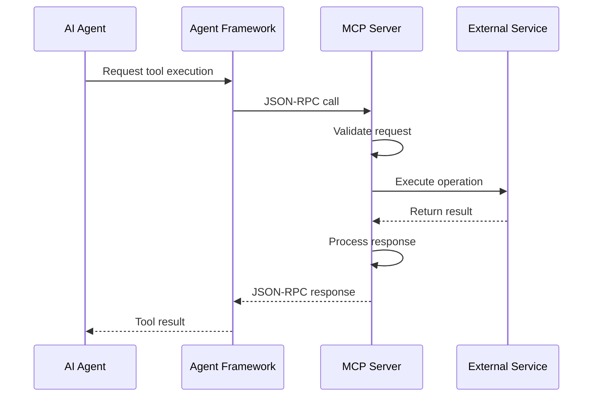

# MCP Server Implementation Guide

This guide provides comprehensive information for implementing, configuring, and extending Model Context Protocol (MCP) servers in the Container Migration Solution Accelerator.

## Overview

Model Context Protocol (MCP) servers provide a standardized way to extend AI agent capabilities with external tools, resources, and services. The Container Migration Solution Accelerator uses MCP to integrate with Azure services (for example: Blob Storage), Microsoft Learn documentation (HTTP), URL fetching, Mermaid validation, and YAML inventory generation.

## MCP Architecture

### Core MCP Concepts

### MCP Protocol Elements

- **Tools**: Executable functions that agents can call
- **Resources**: Data sources and content that agents can access
- **Prompts**: Reusable prompt templates for agent interactions
- **Sampling**: Configuration for model behavior and parameters

### MCP Server Integration Flow

## How MCP is implemented in this repo (v2)

In v2, MCP servers are exposed to agents as **Microsoft Agent Framework tools**:

- **HTTP MCP tool**: used for remote MCP servers (Microsoft Learn)
- **Stdio MCP tool**: used for local MCP servers (spawned as subprocesses)

Where to look:

- Tool wrappers (Agent Framework tools): [src/processor/src/libs/mcp_server/](../src/processor/src/libs/mcp_server/)
- Local server implementations (FastMCP): `src/processor/src/libs/mcp_server/**/mcp_*.py` (under [src/processor/src/libs/mcp_server/](../src/processor/src/libs/mcp_server/))
- Tool registration per step: `src/processor/src/steps/*/orchestration/*_orchestrator.py` (under [src/processor/src/steps/](../src/processor/src/steps/))

Notes:

- Local servers in this repo are implemented using **FastMCP** and are started via `uv run --prerelease=allow ...`.
- The Fetch server is an external MCP server started via `uvx mcp-server-fetch`.
- The v2 orchestrators use the wrappers under [src/processor/src/libs/mcp_server/](../src/processor/src/libs/mcp_server/).

## Current MCP tools/servers in v2

These are the MCP tools actually prepared by the v2 orchestrators:

### Microsoft Learn (HTTP)

- **Tool name**: `Microsoft Learn MCP`
- **Endpoint**: `https://learn.microsoft.com/api/mcp`
- **Used in**: Analysis, Design, Convert, Documentation
- **Wrapper**: [src/processor/src/libs/mcp_server/MCPMicrosoftDocs.py](../src/processor/src/libs/mcp_server/MCPMicrosoftDocs.py)

### Fetch (stdio, external)

- **Tool name**: `Fetch MCP Tool`
- **Executable**: `uvx mcp-server-fetch`
- **Used in**: Analysis, Design, Convert, Documentation

### Azure Blob Storage (stdio)

- **Tool name**: `azure_blob_io_service`
- **Used in**: Analysis, Design, Convert, Documentation
- **Wrapper**: [src/processor/src/libs/mcp_server/MCPBlobIOTool.py](../src/processor/src/libs/mcp_server/MCPBlobIOTool.py)
- **Server**: [src/processor/src/libs/mcp_server/blob_io_operation/mcp_blob_io_operation.py](../src/processor/src/libs/mcp_server/blob_io_operation/mcp_blob_io_operation.py)

### Datetime utilities (stdio)

- **Tool name**: `datetime_service`
- **Used in**: Analysis, Design, Convert, Documentation
- **Wrapper**: [src/processor/src/libs/mcp_server/MCPDatetimeTool.py](../src/processor/src/libs/mcp_server/MCPDatetimeTool.py)
- **Server**: [src/processor/src/libs/mcp_server/datetime/mcp_datetime.py](../src/processor/src/libs/mcp_server/datetime/mcp_datetime.py)

### Mermaid validation/fix (stdio)

- **Tool name**: `mermaid_service`
- **Used in**: Design
- **Wrapper**: [src/processor/src/libs/mcp_server/MCPMermaidTool.py](../src/processor/src/libs/mcp_server/MCPMermaidTool.py)
- **Server**: [src/processor/src/libs/mcp_server/mermaid/mcp_mermaid.py](../src/processor/src/libs/mcp_server/mermaid/mcp_mermaid.py)

### YAML inventory (stdio)

- **Tool name**: `yaml_inventory_service`
- **Used in**: Documentation
- **Wrapper**: [src/processor/src/libs/mcp_server/MCPYamlInventoryTool.py](../src/processor/src/libs/mcp_server/MCPYamlInventoryTool.py)
- **Server**: [src/processor/src/libs/mcp_server/yaml_inventory/mcp_yaml_inventory.py](../src/processor/src/libs/mcp_server/yaml_inventory/mcp_yaml_inventory.py)

## Best Practices

### 1. Server Design

- **Single Responsibility**: Each server should focus on a specific domain
- **Error Handling**: Comprehensive error handling with meaningful messages
- **Resource Management**: Proper cleanup of resources and connections
- **Security**: Implement appropriate authentication and authorization

### 2. Tool Design

- **Clear Documentation**: Provide clear descriptions and input schemas
- **Validation**: Validate all inputs before processing
- **Idempotency**: Design tools to be idempotent when possible
- **Performance**: Optimize for both speed and resource usage

### 3. Configuration

- **Environment-Specific**: Support different configurations for different environments
- **Secrets Management**: Use secure methods for storing sensitive configuration
- **Validation**: Validate configurations at startup
- **Documentation**: Document all configuration options

### 4. Monitoring

- **Performance Metrics**: Track tool performance and usage
- **Error Monitoring**: Monitor and alert on errors
- **Resource Usage**: Track memory and CPU usage
- **Audit Logging**: Log all tool calls for audit purposes

## Next Steps

1. **Understand MCP Concepts**: Learn the core MCP protocol and concepts
2. **Review Existing Servers**: Study the current MCP server implementations
3. **Identify Integration Needs**: Determine what external services need integration
4. **Implement Custom Servers**: Develop custom MCP servers for specific requirements
5. **Test and Monitor**: Implement comprehensive testing and monitoring

For additional information, refer to:

- [Configuring MCP Servers](ConfigureMCPServers.md)
- [Technical Architecture](TechnicalArchitecture.md)
- [Multi-Agent Orchestration Approach](MultiAgentOrchestration.md)
- [Deployment Guide](DeploymentGuide.md)
