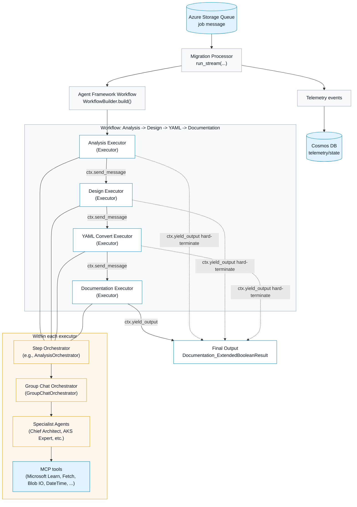

# Workflow & Executor Implementation Guide (Microsoft Agent Framework)

This guide explains how the Container Migration Solution Accelerator processor implements step-based execution using **Microsoft Agent Framework** workflows, orchestrations, and workflow executors.

> Scope: This document describes the **processor runtime and step execution model**. Infrastructure deployment details remain unchanged.

## References (Official Documentation)

- [Microsoft Agent Framework overview](https://learn.microsoft.com/en-us/agent-framework/overview/agent-framework-overview)
- [Workflow core concepts (overview)](https://learn.microsoft.com/en-us/agent-framework/user-guide/workflows/core-concepts/overview)
- [Executors (core concept)](https://learn.microsoft.com/en-us/agent-framework/user-guide/workflows/core-concepts/executors)
- [Workflows (core concept)](https://learn.microsoft.com/en-us/agent-framework/user-guide/workflows/core-concepts/workflows)
- [Workflow orchestrations (patterns)](https://learn.microsoft.com/en-us/agent-framework/user-guide/workflows/orchestrations/overview)
- [Group chat orchestration](https://learn.microsoft.com/en-us/agent-framework/user-guide/workflows/orchestrations/group-chat)
- [Multi-agent orchestration patterns (architecture guidance)](https://learn.microsoft.com/en-us/azure/architecture/ai-ml/guide/ai-agent-design-patterns)

## Overview

The processor executes a migration as a **sequential workflow** of four steps:

1. **Analysis**: discover inputs and detect the source platform
2. **Design**: propose Azure target architecture and migration approach
3. **YAML conversion**: generate converted manifests (AKS-ready)
4. **Documentation**: produce the final migration report and runbook

This repo implements that pipeline using:

- A top-level **Agent Framework Workflow** that routes messages between steps.
- A step-level **Executor** per phase (analysis/design/yaml/documentation).
- A step-level **Orchestrator** (per step) that runs a multi-agent collaboration pattern (typically group chat).

Conceptually:

- **Workflow** = the directed graph of computation (executors + edges) that defines what runs next.
- **Executor** = the unit of work for a step; it receives an input message and emits an output message.
- **Orchestration** = a multi-agent pattern used inside a step (for example group chat), where multiple agents collaborate to produce the step output.

## Process Execution Flow



At the top level, the workflow is deterministic and step-by-step: **analysis → design → yaml → documentation**.

Inside each step, the orchestrator can use multi-agent patterns (maker-checker loops, review sign-offs, etc.) to produce the step result.

## How Agent Framework concepts map to this repository

### Workflow

- Implementation: [src/processor/src/steps/migration_processor.py](../src/processor/src/steps/migration_processor.py)
- The processor creates a workflow with `WorkflowBuilder`.
- It registers four executors, sets the start executor, and defines edges.

Example from the repo (simplified):

```python
from agent_framework import WorkflowBuilder

workflow = (
    WorkflowBuilder()
    .register_executor(lambda: AnalysisExecutor(id="analysis", app_context=app_context), name="analysis")
    .register_executor(lambda: DesignExecutor(id="design", app_context=app_context), name="design")
    .register_executor(lambda: YamlConvertExecutor(id="yaml", app_context=app_context), name="yaml")
    .register_executor(lambda: DocumentationExecutor(id="documentation", app_context=app_context), name="documentation")
    .set_start_executor("analysis")
    .add_edge("analysis", "design")
    .add_edge("design", "yaml")
    .add_edge("yaml", "documentation")
    .build()
)
```

### Executors (step runtime)

Executors are the fundamental building blocks that process typed messages in a workflow.

- Official docs: [Executors (core concept)](https://learn.microsoft.com/en-us/agent-framework/user-guide/workflows/core-concepts/executors)

In this repo, each step executor:

- Inherits from `agent_framework.Executor`
- Implements a handler decorated with `@handler`
- Receives:
  - `message`: typed input payload
  - `ctx`: `WorkflowContext[...]` used to forward messages or yield final output

Repo implementations:

- [src/processor/src/steps/analysis/workflow/analysis_executor.py](../src/processor/src/steps/analysis/workflow/analysis_executor.py)
- [src/processor/src/steps/design/workflow/design_executor.py](../src/processor/src/steps/design/workflow/design_executor.py)
- [src/processor/src/steps/convert/workflow/yaml_convert_executor.py](../src/processor/src/steps/convert/workflow/yaml_convert_executor.py)
- [src/processor/src/steps/documentation/workflow/documentation_executor.py](../src/processor/src/steps/documentation/workflow/documentation_executor.py)

A typical executor shape (based on `AnalysisExecutor`):

```python
from agent_framework import Executor, WorkflowContext, handler


class AnalysisExecutor(Executor):
    def __init__(self, id: str, app_context: AppContext):
        super().__init__(id=id)
        self.app_context = app_context

    @handler
    async def handle_execute(
        self,
        message: Analysis_TaskParam,
        ctx: WorkflowContext[Analysis_BooleanExtendedResult],
    ) -> None:
        result = await AnalysisOrchestrator(self.app_context).execute(task_param=message)

        # Continue the workflow with the next step input
        if result.result and not result.result.is_hard_terminated:
            await ctx.send_message(result.result)

        # Or stop the workflow early with a final output
        elif result.result:
            await ctx.yield_output(result.result)
```

### Orchestrations (multi-agent collaboration inside a step)

- Official docs overview: [Workflow orchestrations (patterns)](https://learn.microsoft.com/en-us/agent-framework/user-guide/workflows/orchestrations/overview)
- Group chat orchestration: [Group chat orchestration](https://learn.microsoft.com/en-us/agent-framework/user-guide/workflows/orchestrations/group-chat)

In this repository, each executor delegates the “AI-heavy” work to a step-specific orchestrator. Those orchestrators typically:

- Prepare MCP tools (e.g., Microsoft Learn, Fetch, Blob IO)
- Load and render prompts
- Construct agent participants (coordinator + specialists)
- Run a multi-agent orchestration (commonly group chat) to produce a typed step output

Repo example:

- [src/processor/src/libs/agent_framework/groupchat_orchestrator.py](../src/processor/src/libs/agent_framework/groupchat_orchestrator.py)

This repo uses group chat for iterative refinement and review-heavy flows (for example documentation sign-off loops), aligning with Microsoft’s guidance that group chat is appropriate for collaborative problem-solving and maker-checker workflows.

## Execution model in this repo

### Step-to-step message flow

At the top level, the workflow is sequential:

- Analysis emits an `Analysis_BooleanExtendedResult`
- Design consumes it and emits a `Design_ExtendedBooleanResult`
- YAML conversion consumes it and emits a `Yaml_ExtendedBooleanResult`
- Documentation consumes it and yields `Documentation_ExtendedBooleanResult` as the final workflow output

### Hard termination vs failure

This repo supports two distinct stop paths:

- **Hard termination (graceful)**: a step decides it cannot proceed and yields an output marked as hard-terminated. The executor calls `ctx.yield_output(...)` to end the workflow with a meaningful final result.
- **Failure (exceptional)**: an executor or workflow fails unexpectedly; the processor captures failure context and reports via telemetry.

See the exception wrappers and failure summary logic in [src/processor/src/steps/migration_processor.py](../src/processor/src/steps/migration_processor.py).

## Adding a new step (executor)

To add a new step:

1. Create a new executor in `src/processor/src/steps/<step>/workflow/<step>_executor.py` (under [src/processor/src/steps/](../src/processor/src/steps/)).
2. Create/update typed models:
    - `src/processor/src/steps/<step>/models/step_param.py` (input)
    - `src/processor/src/steps/<step>/models/step_output.py` (output)
3. Implement the step orchestrator (if multi-agent):
   - `src/processor/src/steps/<step>/orchestration/<step>_orchestrator.py`
4. Register and wire the executor in [src/processor/src/steps/migration_processor.py](../src/processor/src/steps/migration_processor.py) using `WorkflowBuilder`.

## Notes on MCP tools

Microsoft Agent Framework supports tool calling and MCP server integration as first-class concepts.

- Agent Framework MCP docs: [Model Context Protocol (MCP)](https://learn.microsoft.com/en-us/agent-framework/user-guide/model-context-protocol/)

In this repo, MCP servers are integrated as **Agent Framework tools** used by orchestrators and agents.

## See also

- Multi-agent orchestration guide in this repo: [docs/MultiAgentOrchestration.md](MultiAgentOrchestration.md)
- Overall processor architecture: [docs/AgenticArchitecture.md](AgenticArchitecture.md)
- MCP tool configuration and server guide: [docs/ConfigureMCPServers.md](ConfigureMCPServers.md) and [docs/MCPServerGuide.md](MCPServerGuide.md)

## Step implementations (real code)

This repository no longer uses the previous process-framework step model for the processor pipeline.

Instead, each step is implemented as:

1. A **workflow executor** (Agent Framework `Executor`) that receives a typed message.
2. A step **orchestrator** that runs a multi-agent collaboration pattern (typically group chat) and returns a typed step result.

Where to look:

- Top-level workflow wiring: [src/processor/src/steps/migration_processor.py](../src/processor/src/steps/migration_processor.py)
- Step executors:
    - [src/processor/src/steps/analysis/workflow/analysis_executor.py](../src/processor/src/steps/analysis/workflow/analysis_executor.py)
    - [src/processor/src/steps/design/workflow/design_executor.py](../src/processor/src/steps/design/workflow/design_executor.py)
    - [src/processor/src/steps/convert/workflow/yaml_convert_executor.py](../src/processor/src/steps/convert/workflow/yaml_convert_executor.py)
    - [src/processor/src/steps/documentation/workflow/documentation_executor.py](../src/processor/src/steps/documentation/workflow/documentation_executor.py)
- Step orchestrators (multi-agent logic): `src/processor/src/steps/**/orchestration/` (under [src/processor/src/steps/](../src/processor/src/steps/))
- Group chat orchestration implementation: [src/processor/src/libs/agent_framework/groupchat_orchestrator.py](../src/processor/src/libs/agent_framework/groupchat_orchestrator.py)

Executor handlers use `WorkflowContext` to either:

- Continue the pipeline via `ctx.send_message(...)`, or
- Stop early with a final result via `ctx.yield_output(...)`.

## Workflow execution and event streaming

The processor runs the top-level workflow using event streaming in `MigrationProcessor.run(...)`:

- Implementation: [src/processor/src/steps/migration_processor.py](../src/processor/src/steps/migration_processor.py)
- Execution: `async for event in self.workflow.run_stream(input_data): ...`

The processor consumes events such as:

- `WorkflowStartedEvent`
- `ExecutorInvokedEvent`
- `ExecutorCompletedEvent`
- `ExecutorFailedEvent`
- `WorkflowOutputEvent`
- `WorkflowFailedEvent`

Those events are used to:

- Drive step/phase telemetry (`TelemetryManager`).
- Populate structured reporting (`MigrationReportCollector` / `MigrationReportGenerator`).

This is also where the processor differentiates between:

- **Hard termination** (a step yields an output early via `ctx.yield_output(...)`), and
- **Exceptional failure** (a step errors, producing `ExecutorFailedEvent` / `WorkflowFailedEvent`).

## MCP tools integration (Agent Framework tools)

In this repo, MCP servers are integrated as **Agent Framework tools**.

Where to look:

- Tool wrappers: [src/processor/src/libs/mcp_server/](../src/processor/src/libs/mcp_server/)
- Tool usage: `src/processor/src/steps/**/orchestration/` (under [src/processor/src/steps/](../src/processor/src/steps/))

Two connection styles are used:

1. **HTTP MCP tools** (remote)
   - Example: Microsoft Learn MCP endpoint
   - Used via `MCPStreamableHTTPTool(name="Microsoft Learn MCP", url="https://learn.microsoft.com/api/mcp")`

2. **Stdio MCP tools** (local subprocess)
   - Example: blob IO, datetime, mermaid validation, yaml inventory
   - Used via `MCPStdioTool(command="uv", args=[...])`
    - Local MCP servers in this repo are implemented using FastMCP under [src/processor/src/libs/mcp_server/](../src/processor/src/libs/mcp_server/).

When a step runs, orchestrators typically open tool sessions like this:

```python
async with (
    self.mcp_tools[0],
    self.mcp_tools[1],
    self.mcp_tools[2],
):
    ...
```

## Reporting and telemetry

Reporting and telemetry are driven by workflow execution events and captured in the processor:

- Telemetry: [src/processor/src/utils/agent_telemetry.py](../src/processor/src/utils/agent_telemetry.py) (`TelemetryManager`)
- Reporting: [src/processor/src/libs/reporting/](../src/processor/src/libs/reporting/) (`MigrationReportCollector`, `MigrationReportGenerator`)
- Event loop: [src/processor/src/steps/migration_processor.py](../src/processor/src/steps/migration_processor.py)

## Evaluation and quality checks

The processor’s “quality checks” are a combination of workflow-level structure plus step-level validation:

- **Typed boundaries**: each executor consumes and emits typed models, which keeps step-to-step contracts explicit.
- **Multi-agent review**: orchestrators can implement maker-checker loops and sign-offs (commonly via group chat).
- **Tool-backed validation**: steps can call MCP tools (e.g., Mermaid validation, YAML inventory grounding, documentation lookups) to validate outputs against real inputs and references.
- **Unit tests**: core behavior is covered by tests under [src/processor/src/tests/unit/](../src/processor/src/tests/unit/).

To run processor unit tests locally (example):

```bash
cd src/processor
uv run --prerelease=allow python -m pytest src/processor/src/tests/unit -v
```

## Extending the pipeline

Use the steps in “Adding a new step (executor)” above, then wire the executor into the workflow graph in [src/processor/src/steps/migration_processor.py](../src/processor/src/steps/migration_processor.py).

## Troubleshooting notes

- If a step appears to “hang”, check MCP tool startup (stdio tools spawn subprocesses via `uv`/`uvx`).
- If an executor fails, the processor surfaces structured details via `WorkflowExecutorFailedException`.
- If the workflow completes but the output is missing, the processor raises `WorkflowOutputMissingException`.

## Next steps

- [Multi-Agent Orchestration Approach](MultiAgentOrchestration.md)
- [Technical Architecture](TechnicalArchitecture.md)
- [Adding Custom Expert Agents](CustomizeExpertAgents.md)
- [Configuring MCP Servers](ConfigureMCPServers.md)
