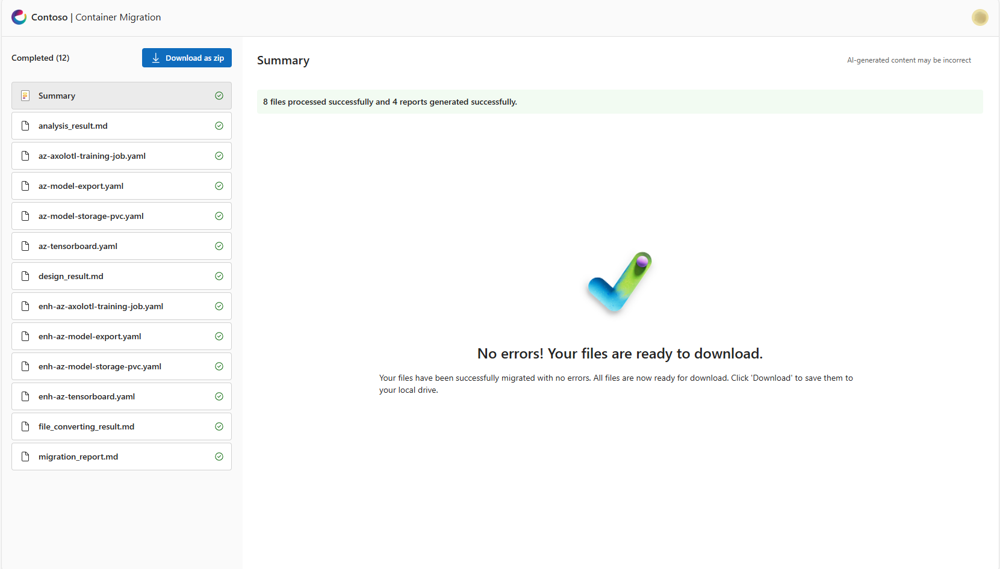

# Sample Workflow

To help you get started, sample Informix queries have been included in the data/informix/functions and data/informix/simple directories. You can choose to upload these files to test the application.

## **Process**

> Note: Download Sample Data - You can down load all the sample kubernetes (.yaml) files from EKS & GKE folder from the test_files folder of the repo

### **API Documentation**

_Sample Operation:_

- Task: Click on 'API Documentation' to view and explore the available API endpoints and their details

### **Upload**
The Browse section allows users to explore and retrieve information related to promissory notes. Key functionalities include:

_Sample Qperations:_

- Task: Select File – Choose all 4 files from the downloaded list for data extraction.Process each batch individually
First Batch -> All 4 files from  EKS folder 
Second Batch -> All  4 files from GKE folder
- Task: Upload Files – Click the "Upload" button. Multiple files(All 4) can be uploaded at the same time.
- Task: Check Upload Status - A green banner with a message "All valid files uploaded successfully!" confirming all the valid files have been uploaded successfully will appear 
- Task:Click Start Processing Button to Process Files - Once the files have been uploaded, clicking Start Processing Button will trigger the migration process for the current batch.

### **Review**
The Generate section enables users to create new promissory notes with customizable options. Key features include:

_Sample Qperation:_

- Task: Review MigrationProcess - 
The batch Processing page will get opened up and the Migration process will be visible. It will have smaller messages in a caraousel box and the agent working and phase will be provided in the message.
- Task: Review Migrated FIles & Reports - 
Once the batch Processing is done for all the files then all the files with 4 reports will be available to review. 
  
### **Download**
The Draft section ensures accuracy and completeness of the generated promissory notes. Key tasks include:

_Sample operation:_

- Task: Download .zip file-
Once all the files have been migrated the button at the left bottom will be enabled to download a .zip file which contains all the migrated files and reports related to the migration process for the uploaded batch.

 
  
This structured approach ensures that users can efficiently browse, create, and refine promissory notes while maintaining legal compliance and document accuracy.
